# Отчет по практической работе №2
## Студент: [ФИО]
## Группа: [номер группы]
## Дата выполнения: [дата]
### 1. Информация о кластере
#### 1.1 Статус Minikube
[вставьте вывод minikube status]
text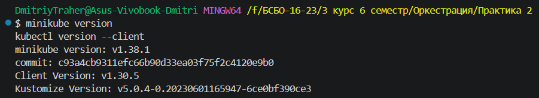
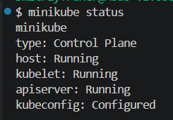

#### 1.2 Узлы кластера
[вставьте вывод kubectl get nodes -o wide]
text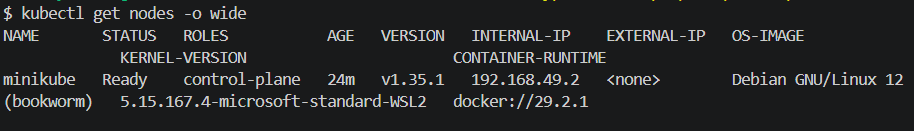

### 2. Созданные ресурсы

#### 2.1 Pods
[вставьте вывод kubectl get pods -o wide]
text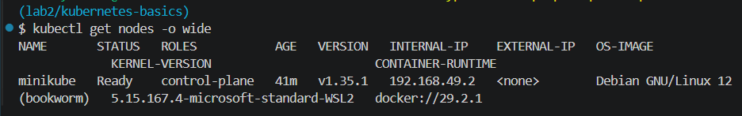
[ kubectl get nodes -o wide]
text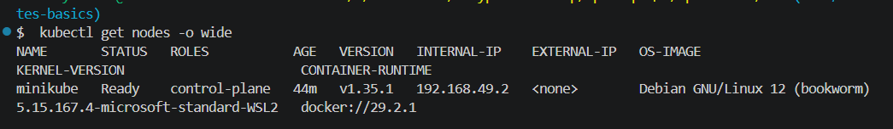

#### 2.2 Deployments
[вставьте вывод kubectl get deployments]
text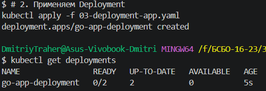
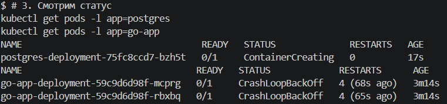

#### 2.3 Services
[вставьте вывод kubectl get services]
text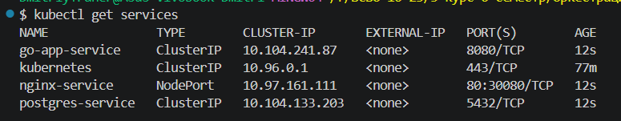

### 3. Скриншоты работы приложения

#### 3.1 Главная страница
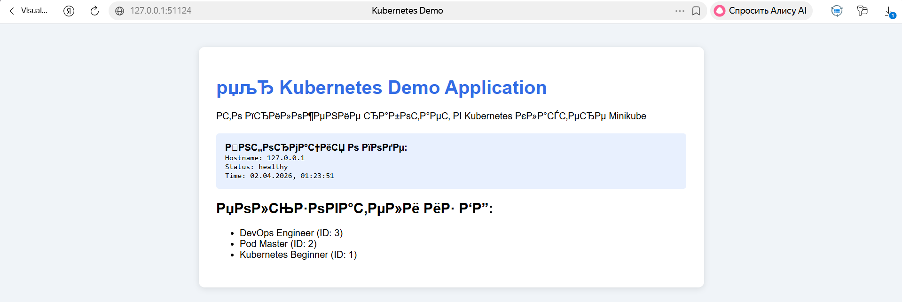

#### 3.2 Дашборд Kubernetes
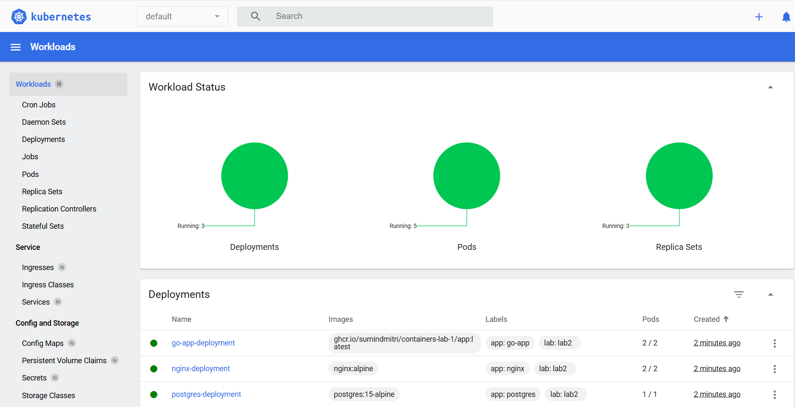
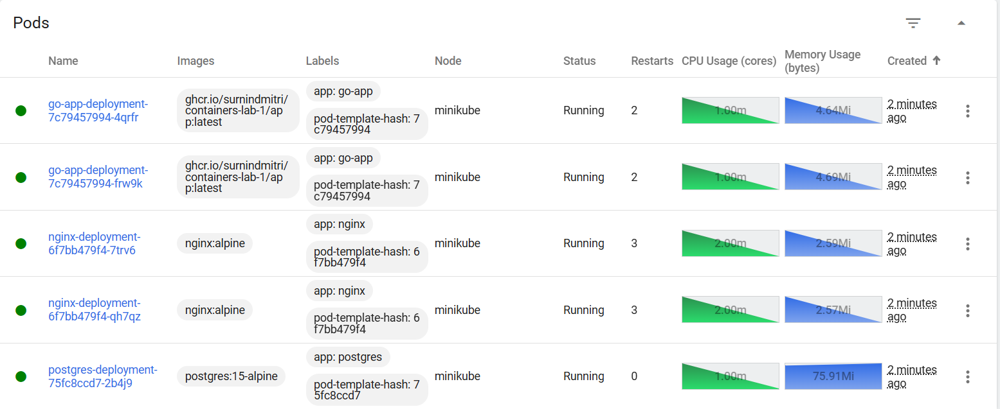

#### 3.3 Результат GET /api/users
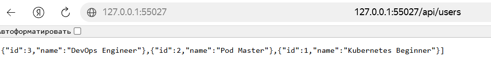

### 4. Эксперименты с масштабированием

#### 4.1 Масштабирование до 5 реплик
[команда и вывод kubectl scale]
text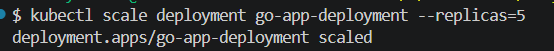

#### 4.2 Проверка распределения нагрузки
[логи nginx с разных подов]
text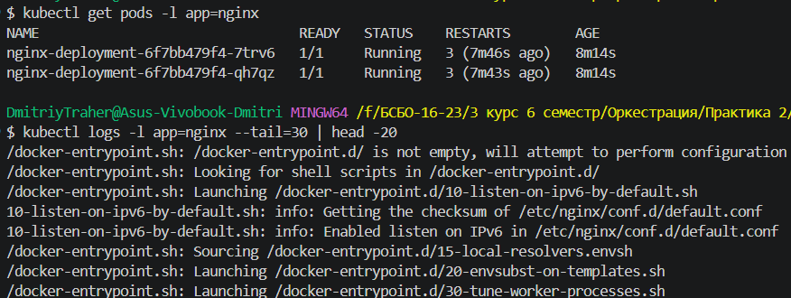
\`\`\`
### 5. GitHub Actions
#### 5.1 Успешная валидация манифестов
![GitHub Actions Validation] 

### 6. Ответы на контрольные вопросы
1. **В чем разница между Pod и Deployment?**  
   Pod — это минимальная единица развертывания в Kubernetes, которая содержит один или несколько контейнеров. Deployment — это более высокий уровень абстракции, который управляет ReplicaSet'ами, обеспечивает стратегии обновления (RollingUpdate), откат изменений и желаемое количество реплик. Deployment автоматически создаёт и управляет ReplicaSet'ами.

2. **Для чего нужен Service типа ClusterIP?**  
   Service типа ClusterIP предоставляет стабильный виртуальный IP-адрес внутри кластера для доступа к подам. Он используется для коммуникации между компонентами приложения (например, Go-app обращается к PostgreSQL по имени `postgres-service`), при этом поды могут пересоздаваться и менять свои IP-адреса, а Service остаётся постоянным.

3. **Как ReplicaSet обеспечивает самовосстановление?**  
   ReplicaSet постоянно следит за количеством подов, соответствующих его селектору. Если один из подов упадёт или будет удалён, ReplicaSet автоматически создаст новый под вместо него, чтобы поддерживать заданное количество реплик (`replicas: 3`).

4. **Что произойдет с приложением, если удалить под PostgreSQL?**  
   Если удалить под PostgreSQL, то Deployment сразу создаст новый под вместо него (самовосстановление). Однако на короткое время Go-приложение не сможет подключаться к базе данных и будет выдавать ошибки подключения, пока новый под PostgreSQL не запустится и не инициализируется.
### 7. Выводы
В ходе выполнения лабораторной работы я познакомился с основными объектами Kubernetes: Pod, ReplicaSet, Deployment и Service. Научился писать YAML-манифесты, использовать kubectl для управления кластером и развернул многокомпонентное приложение (Go + PostgreSQL + Nginx) в Minikube.

Основные трудности:
- Проблемы с именем образа в GHCR (регистр букв)
- Go-app не проходил readinessProbe, из-за чего поды показывали 0/1 Ready
- Настройка доступа к GitHub Container Registry через Secret
- Работа с Minikube на Windows (память, драйвер Docker)

В целом работа дала хорошее понимание, как Kubernetes оркестрирует контейнеры и решает типичные задачи production-среды (самовосстановление, сервис-дискавери, rolling update).
