# Отчет по практической работе №3
## Студент: Сурнин Дмитрий Сергеевич
## Группа: БСБО-16-23
## Дата выполнения: 25.04.26
### 1. Подготовка узлов
#### 1.1 Версия ОС и настройки
\`\`\`
[вставьте вывод cat /etc/os-release с master-узла]
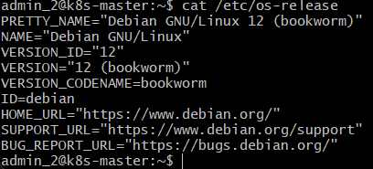
\`\`\`
#### 1.2 Отключение swap
\`\`\`
[вставьте вывод free -m]
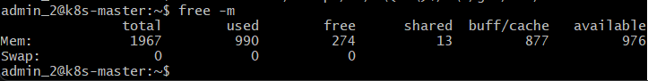
\`\`\`
#### 1.3 Модули ядра
\`\`\`
[вставьте вывод lsmod | grep -E "overlay|br_netfilter"]
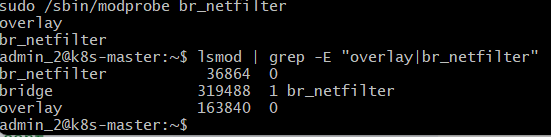
\`\`\`
### 2. Установка containerd
#### 2.1 Версия containerd
\`\`\`
[вставьте вывод containerd --version]
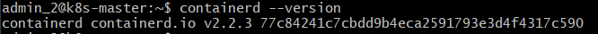
\`\`\`
#### 2.2 Конфигурация containerd
\`\`\`
[вставьте содержимое /etc/containerd/config.toml (только секцию с SystemdCgroup)]
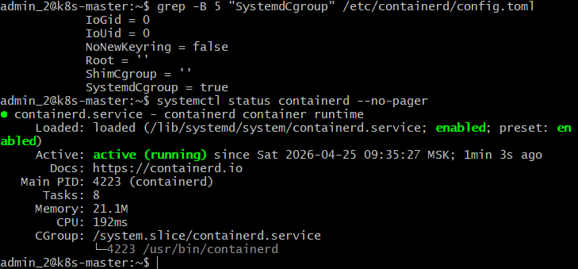
\`\`\`
### 3. Установка kubeadm
#### 3.1 Версии компонентов
\`\`\`
[вставьте вывод kubeadm version, kubelet --version, kubectl version --client]
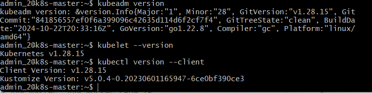
\`\`\`
### 4. Инициализация кластера
#### 4.1 Узлы кластера
\`\`\`
[вставьте вывод kubectl get nodes -o wide]
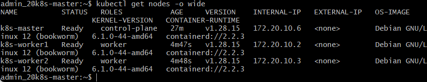
\`\`\`
#### 4.2 Поды в namespace kube-system
\`\`\`
[вставьте вывод kubectl get pods -n kube-system]
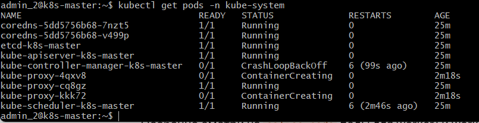
\`\`\`
### 5. Сетевые компоненты
#### 5.1 Calico
\`\`\`
[вставьте вывод kubectl get pods -n calico-system]
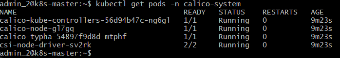
\`\`\`
#### 5.2 MetalLB
\`\`\`
[вставьте вывод kubectl get pods -n metallb-system]
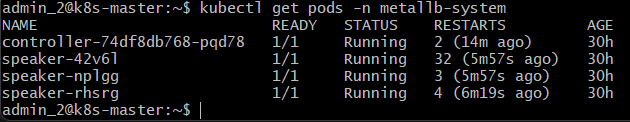
\`\`\`
[вставьте вывод kubectl get ipaddresspools -n metallb-system]
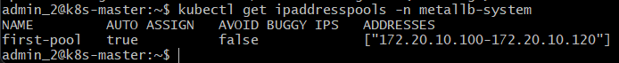
#### 5.3 Ingress Controller
\`\`\`
[вставьте вывод kubectl get pods -n ingress-nginx]
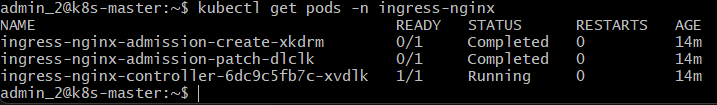
\`\`\`
[вставьте вывод kubectl get svc -n ingress-nginx]
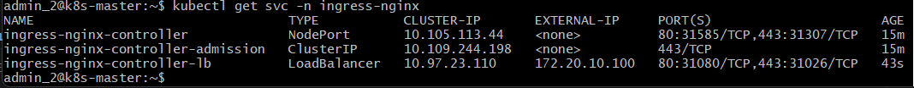
### 6. Развернутое приложение
#### 6.1 Все ресурсы в namespace lab3-app
\`\`\`
[вставьте вывод kubectl get all -n lab3-app]
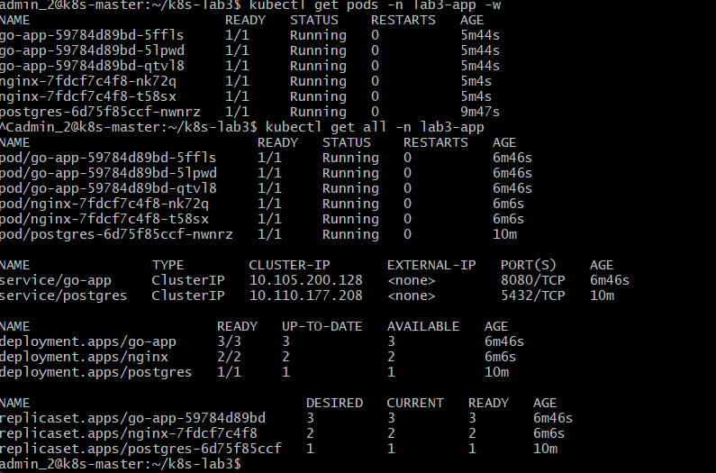
\`\`\`
#### 6.2 PersistentVolumeClaim
\`\`\`
[вставьте вывод kubectl get pvc -n lab3-app]
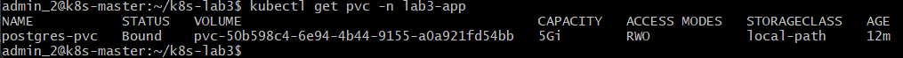
\`\`\`
### 7. Скриншоты
#### 7.1 Главная страница приложения
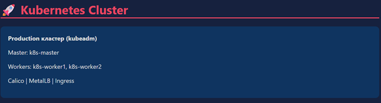
#### 7.2 Дашборд с информацией о поде
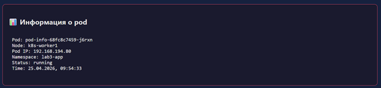
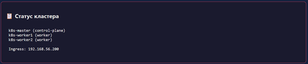
#### 7.3 Список пользователей из БД

### 8. Тестирование отказоустойчивости
#### 8.1 Симуляция отказа узла
\`\`\`
[вставьте последовательность команд и их вывод, показывающие]
[как поды перезапускаются на других узлах]
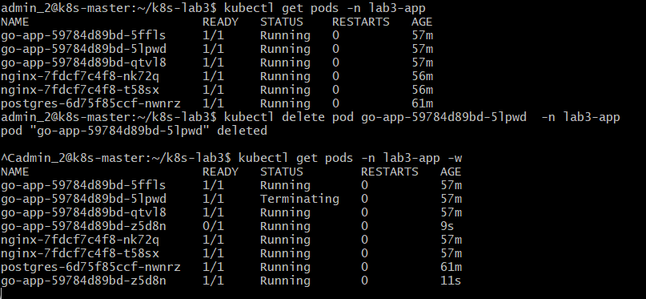
\`\`\`
#### 8.2 Проверка сохранности данных
\`\`\`
[вставьте вывод SQL-запроса после перезапуска PostgreSQL]
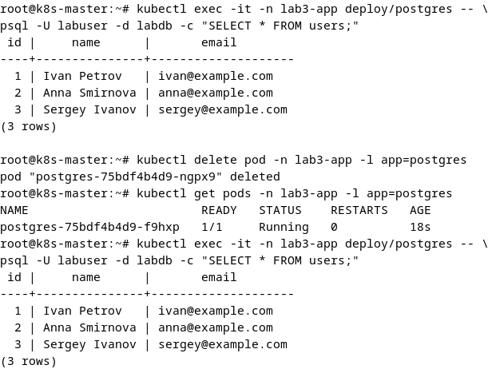
\`\`\`
### 9. Ответы на контрольные вопросы
Какие компоненты входят в control plane и какова их роль?

kube-apiserver: «Сердце» кластера, единая точка входа для всех запросов API (от kubectl и внутренних компонентов).

etcd: Распределенное хранилище типа «ключ-значение», где хранятся все данные о состоянии кластера.

kube-scheduler: Отвечает за выбор узла, на котором будет запущен новый под (на основе ресурсов и политик).

kube-controller-manager: Запускает циклы контроля, которые следят за состоянием кластера (например, контроллер репликации следит, чтобы количество подов соответствовало требуемому).

cloud-controller-manager (опционально): Связывает кластер с API провайдера облачных услуг.

Чем отличается развертывание с kubeadm от использования Minikube?

Minikube: Предназначен для локальной разработки и обучения. Создает кластер из одного узла внутри виртуальной машины или контейнера.

kubeadm: Инструмент для развертывания полноценных кластеров (production-ready). Позволяет строить многоузловые кластеры с гибкой настройкой сети, хранилищ и безопасности.

Для чего нужен CNI-плагин и какую роль выполняет Calico?

CNI (Container Network Interface) — стандарт, определяющий способ взаимодействия сетевых плагинов с контейнерами.

Calico обеспечивает сетевое взаимодействие между подами на разных узлах, управляет маршрутизацией и поддерживает политики сетевой безопасности (Network Policies), ограничивающие трафик между подами.

В чем разница между Service типа NodePort, LoadBalancer и Ingress?

NodePort: Открывает порт на каждом узле кластера; трафик перенаправляется на сервис. Небезопасно для prod-среды.

LoadBalancer: Создает внешний балансировщик (обычно в облаке) для доступа к сервису снаружи.

Ingress: Контроллер, работающий на уровне 7 (HTTP/HTTPS). Позволяет управлять доступом к сервисам по доменным именам и путям, поддерживая SSL-терминацию.

Как обеспечивается отказоустойчивость control plane?

Запуском нескольких экземпляров компонентов Control Plane на разных Master-узлах (обычно 3+).

Использованием высокодоступного хранилища etcd (кластер etcd с нечетным количеством узлов для достижения консенсуса).

Наличием балансировщика нагрузки перед API-серверами.
### 10. Выводы
В ходе работы над данной лабораторной работой я прошел путь от развертывания базовой инфраструктуры до настройки отказоустойчивых сервисов в Kubernetes.

Трудности, с которыми столкнулся:

Конфигурация сетевого взаимодействия (CNI) и борьба с политиками безопасности.

Отладка Service и Ingress, когда трафик «не доходил» до пода из-за ошибок в лейблах или конфигурации портов.

Разбор логов в распределенной системе (сложность сбора информации с разных узлов).

Что узнал:

Понял принцип декларативного подхода к управлению инфраструктурой (YAML-манифесты).

Освоил инструменты диагностики (kubectl logs, describe, get events).

Научился тестировать отказоустойчивость, имитируя аварии (chaos engineering), что позволило увидеть «самолечение» кластера в действии.

Данная работа позволила осознать важность подготовки инфраструктуры к сбоям и необходимость мониторинга состояния приложений в реальном времени.