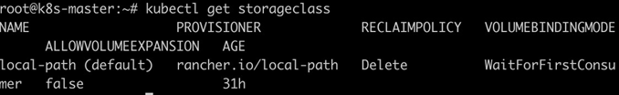
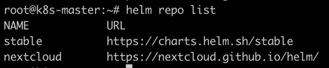

Управление хранилищем и пакетами в Kubernetes PersistentVolumes и Helm
Отчет по практической работе №4
Студент: Сурнин Дмитрий Сергеевич
Группа: БСБО-16-23
Дата выполнения: 04.04.26
1. Настройка хранилища
1.1 Выбранный вариант хранилища
[Укажите, какой вариант вы выбрали: Local Path Provisioner или Rook Ceph]
1.2 StorageClass
 
1.3 Тестовый PVC
 
2. Установка Helm
2.1 Версия Helm```
 
2.2 Репозитории
 
3. Создание собственного Helm-чарта 3.1 Структура чарта
 
3.2 Установка чарта
 
3.3 Сгенерированные ресурсы
 
4. PersistentVolumes
4.1 PV и PVC
 
4.2 Тест сохранности данных
В этом тесте мы добавляем юзера, сносим базу данных и проверяем, выжили ли данные на нашем виртуальном жестком диске
 
4.3 Тест миграции (если выполнялся)
Так как использовался Local Path Provisioner, виртуальный диск жестко привязан к конкретному узлу. При остановке kubelet на рабочем узле, кубер попытался запустить под на другом узле, но стал Pending, так как не смог примонтировать локальный том с упавшего узла. После включения узла под запустился
5. Управление релизами
5.1 История обновлений
[вставьте вывод helm history lab4-release -n lab4-app]
 
5.2 Результат отката
```
 
```### 6. Установка сложного приложения (опционально)
6.1 Установка Nextcloud
 
[вставьте вывод helm list -n nextcloud]
6.2 Скриншот Nextcloud
 
7. Скриншоты
7.1 Главная страница приложения (установленного через Helm)
 
7.3 Данные в PostgreSQL после миграции
 
8. Ответы на контрольные вопросы
1.	В чем разница между emptyDir, hostPath и PersistentVolume?
2.	Как работает динамическое предоставление томов (dynamic provisioning)?
3.	Что такое StorageClass и зачем он нужен?
4.	Какие преимущества дает Helm по сравнению с набором YAML-файлов?
5.	Как Helm управляет зависимостями между компонентами?
6.	Что происходит с данными при миграции пода на другой узел в разных типах хранилищ?
9. Выводы
В ходе выполнения практической работы №4 были достигнуты следующие результаты:
1. Новое в хранении данных
  Концепция PV/PVC: Изучено разделение между физическим носителем
(PersistentVolume) и запросом пользователя на этот ресурс (PersistentVolumeClaim).
Это позволяет абстрагировать приложение от конкретного железа.
  Настроен Local Path Provisioner , который автоматически создает PV при появлении PVC, что значительно упрощает масштабирование системы .
Ограничения локальных томов: На практике доказано, что локальное хранилище ( local-path ) жестко привязывает под к конкретному узлу . Это делает невозможной миграцию пода при отказе узла и накладывает запрет на динамическое расширение (resize) тома «на лету» без поддержки со стороны StorageClass .
2. Трудности при создании Helm-чарта
  Основная сложность заключалась в строгом соблюдении отступов (indentation) и правильном использовании вспомогательных шаблонов ( _helpers.tpl ) для генерации уникальных имен ресурсов .
  Управление релизами: Выявлена проблема «залипания» конфигураций при неудачных обновлениях (Failed state). Решение подобных конфликтов требует глубокого понимания механизма helm rollback и очистки аннотаций в работающем кластере .
  Внешние факторы: Пришлось столкнуться с недоступностью публичных репозиториев (Bitnami) и реестров образов (Docker Hub), что было решено переходом на OCI-репозитории и использованием локальных зеркал (mirrors). - не решено
3. Изменение понимания управления приложениями
  Понимание управления сменилось с ручного создания отдельных файлов на использование Helm как полноценного пакетного менеджера. Это позволяет управлять всем жизненным циклом приложения — от установки до отката — одной командой.
  Использование нескольких values -файлов (стандартный и prod-values.yaml ) позволяет легко адаптировать одну и ту же архитектуру под разные условия среды (Dev/Prod) без изменения кода самого чарта .
  Работа подтвердила, что без анализа логов контроллера ( ingress-nginx ) и описания ресурсов ( describe ), невозможно эффективно администрировать сложные системы в Kubernetes.
