# Отчет по практической работе №1
## Студент: СДС
## Группа: БСБО
## Дата выполнения: 05.03.2026
### 1. Выполненные команды Docker
#### 1.1 Работа с образами
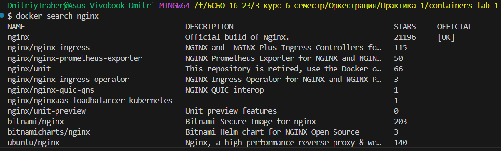
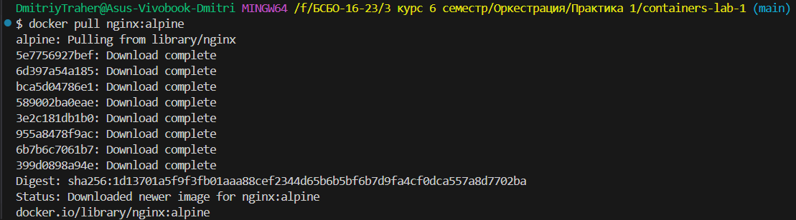
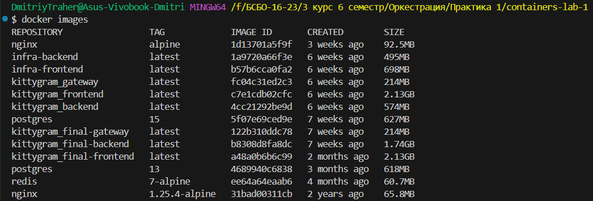
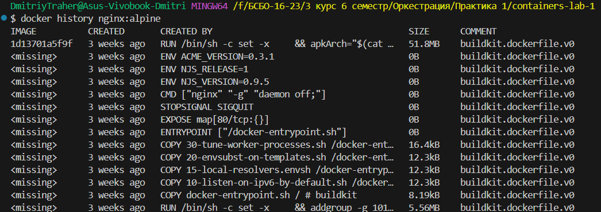
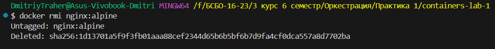
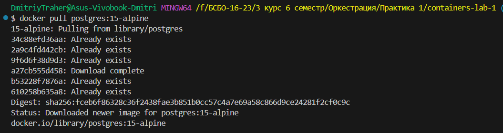
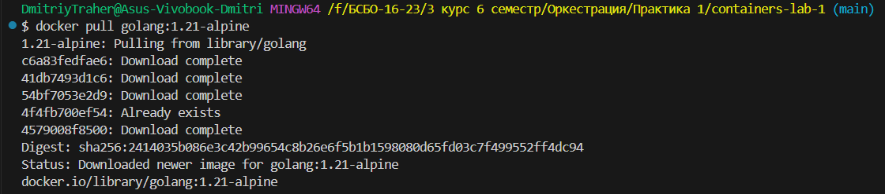
#### 1.2 Работа с контейнерами
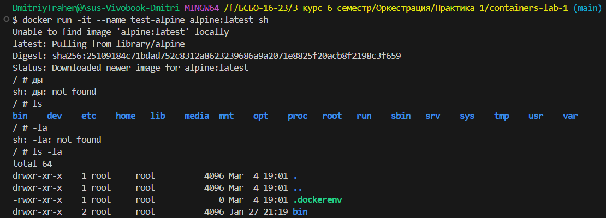
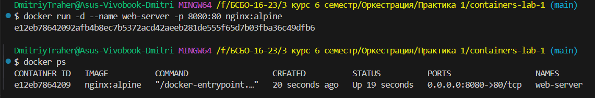
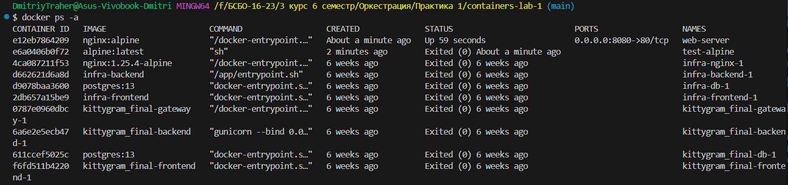
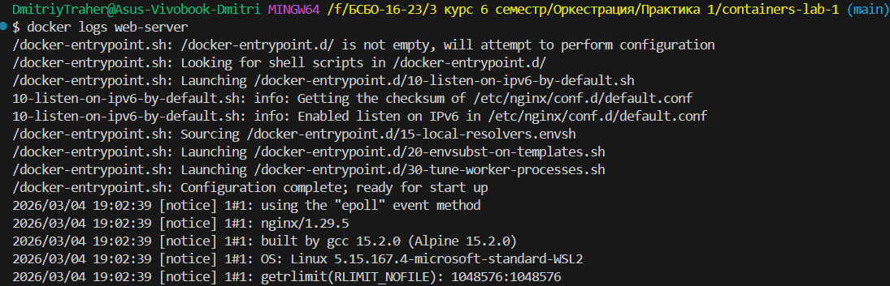
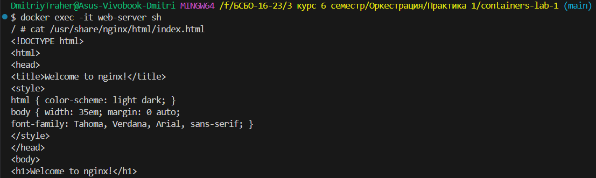
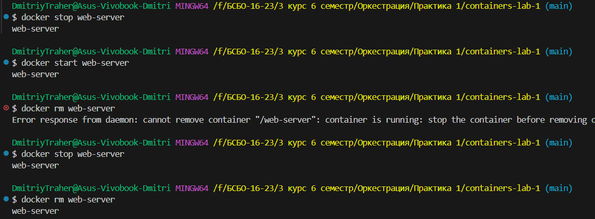
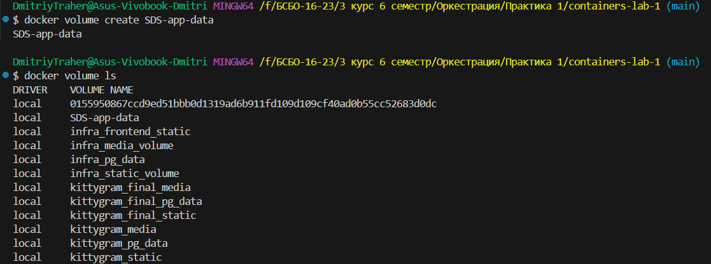
#### 1.3 Работа с томами
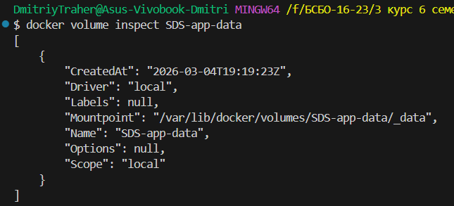
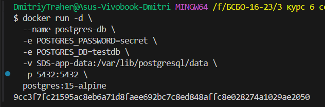
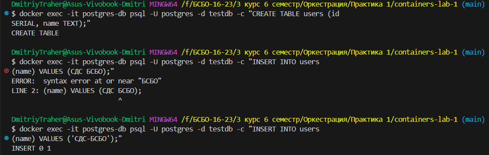
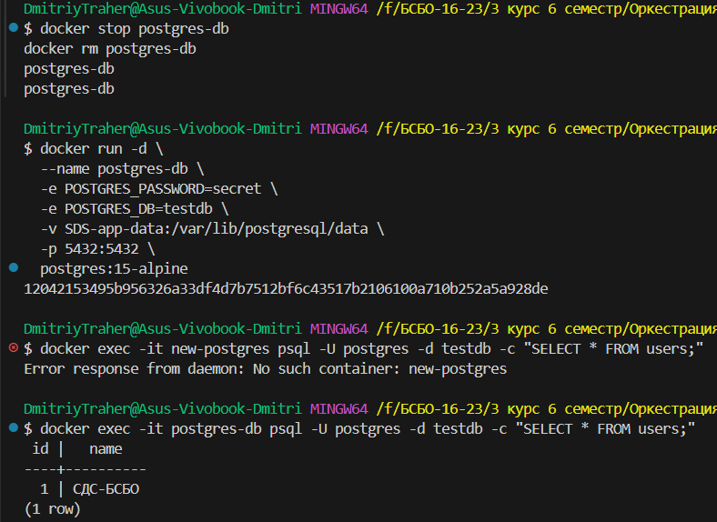
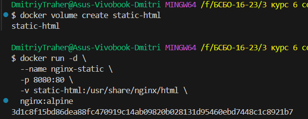
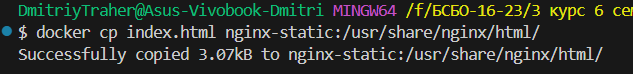
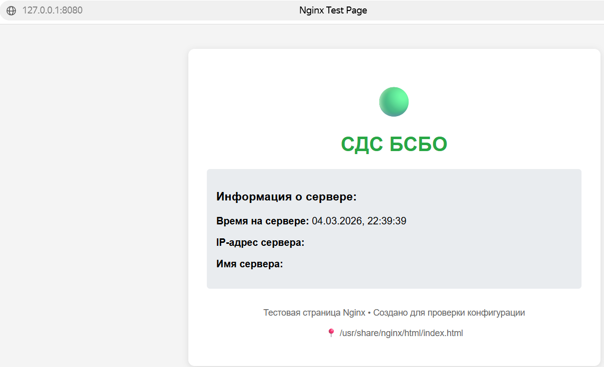
#### 1.4 Работа с сетями
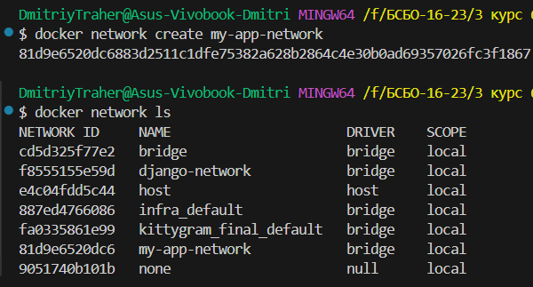
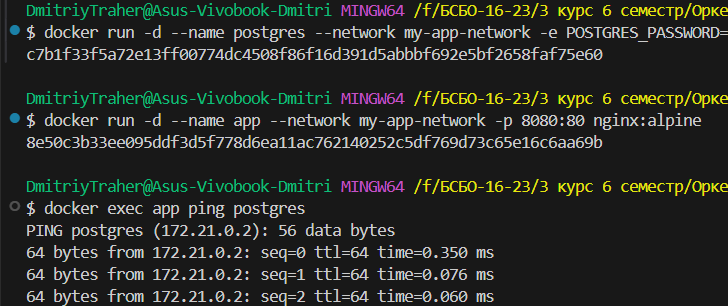
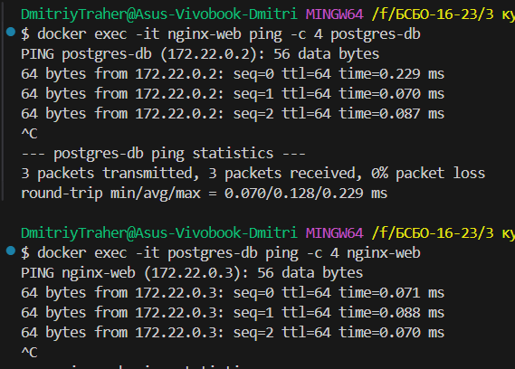
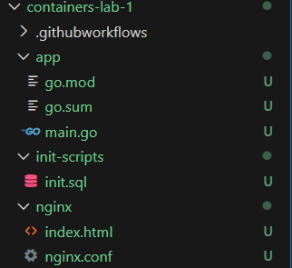
#### 1.4 Разработка приложения
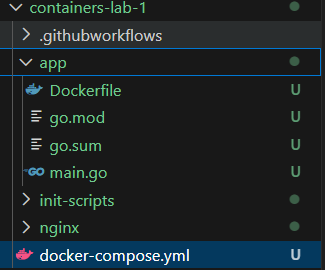
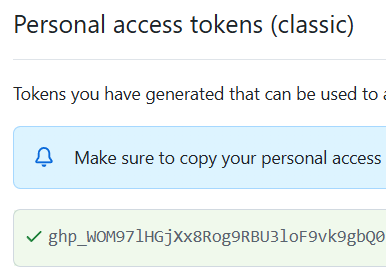
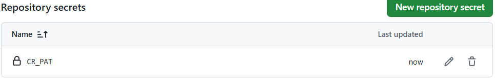
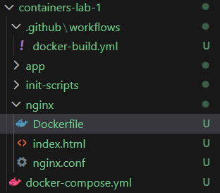
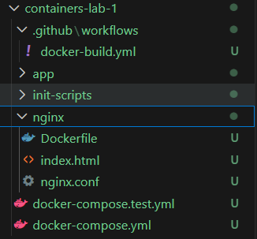
### 2. Скриншоты работающего приложения
#### 2.1 Главная страница
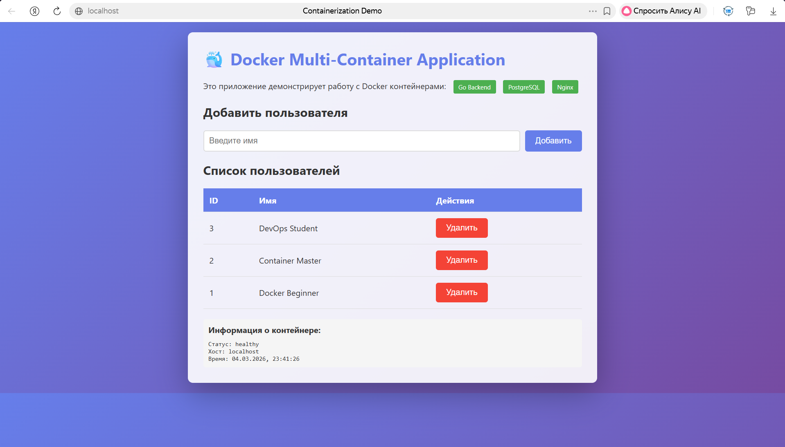
#### 2.2 Добавление пользователя
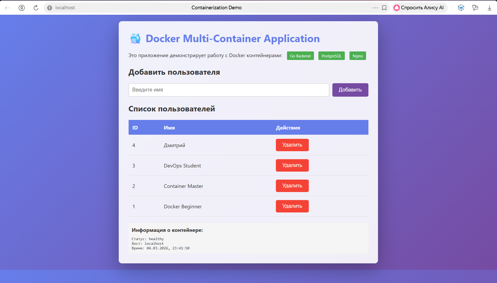
#### 2.3 Список пользователей в БД
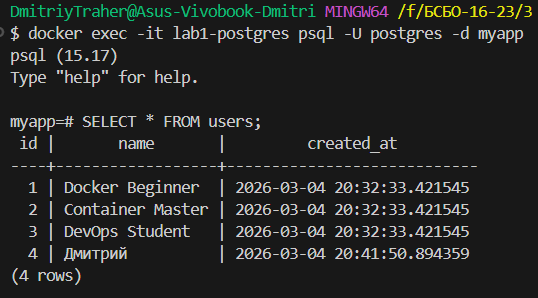
### 3. GitHub Actions
#### 3.1 Успешный запуск workflow
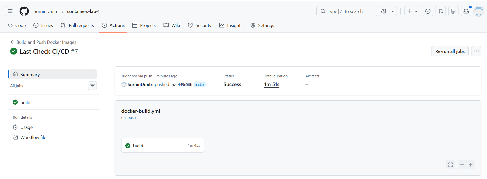
#### 3.2 Опубликованные образы в GHCR
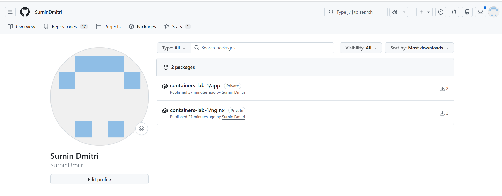
### 4. Выводы
В ходе выполнения практической работы я освоил базовые принципы работы с Docker и контейнеризацией приложений. Было изучено создание Docker-образов, запуск и управление контейнерами, работа с томами и сетями.

Также была настроена автоматическая сборка и публикация образов с использованием GitHub Actions.